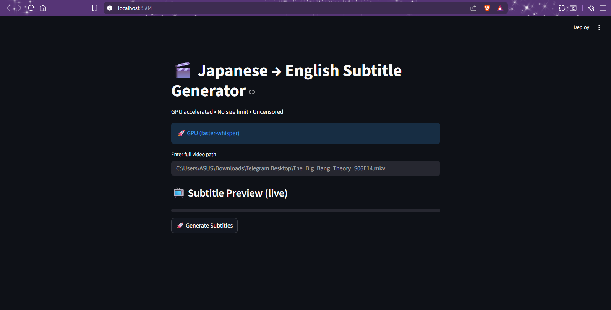

Japanese → English Subtitle Generator

A local subtitle generator that converts Japanese video audio into English .srt subtitles using faster-whisper with a simple Streamlit web interface. The application supports both CPU and GPU (CUDA) acceleration for faster transcription.

✨ Features

Japanese → English subtitle generation

CPU and GPU (CUDA) inference support

Faster-Whisper backend for efficient transcription

Handles long videos (1–2+ hours)

Progress indicator with ETA

Live subtitle preview

Local processing (privacy-friendly, no cloud APIs)

🛠 Requirements

Python 3.10+

NVIDIA GPU with CUDA support (optional but recommended for speed)

CUDA-enabled PyTorch (for GPU mode)

FFmpeg (installed separately and added to PATH)

📦 Installation
python -m venv venv
source venv/bin/activate   # On Windows: venv\Scripts\activate
python -m pip install -r requirements.txt

▶️ Usage
streamlit run app.py

Open the local Streamlit URL in your browser, upload a video, and generate subtitles.

⚡ Performance (CPU vs GPU)

CPU Mode: Works on any machine but slower for long videos.

GPU Mode (Recommended): Significantly faster using NVIDIA CUDA.

Example configuration in code:

from faster_whisper import WhisperModel

# GPU (faster)
model = WhisperModel("small", device="cuda", compute_type="float16")

# CPU (fallback)
# model = WhisperModel("small", device="cpu", compute_type="int8")

🗺️ Roadmap

 CPU inference support

 GPU acceleration (CUDA)

 Improve translation accuracy

 Batch processing for multiple videos

 Optional deployment as a web service

📎 Notes

FFmpeg must be installed separately and accessible via system PATH.

Tested on Windows. GPU performance depends on CUDA-compatible NVIDIA hardware.

## 📸 Screenshots

